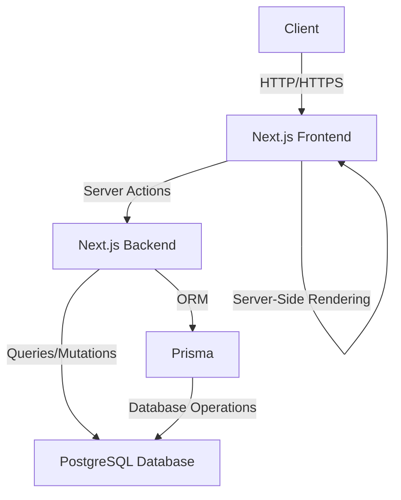
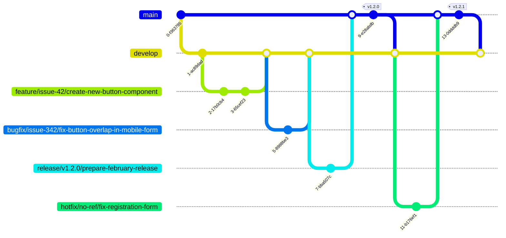

# 📚 Tickeo Project Documentation

## 1. 🎯 Overview

### Main Objective

> Migrate the current Tickeo web app, implementing new changes to improve its architecture, design, and add new features.

### Specific Objectives

- ✅ Improve the overall quality of the website.
- 🏗️ Implement a more robust and maintainable architecture.
- ⚡ Optimize performance and user experience.
- 🔧 Facilitate the addition of new functionalities.

### Main Technologies

| Area | Technology |
| --- | --- |
| Frontend | React with Next.js |
| Backend | Next.js - using server actions |
| Database | PostgreSQL |
| ORM | Prisma |
| Payment Gateway | Stripe |
| Email Service | Resend |

## 2. 🏛️ Architecture

### General Architecture Diagram



### Entity-Relationship Diagram

```mermaid title="Tickeo ERD" type="diagram"
erDiagram
    User ||--o{ UserRole : "has"
    Role ||--o{ UserRole : "assigned to"
    User ||--o{ BusinessEmployee : "is"
    Business ||--o{ BusinessEmployee : "has"
    User ||--o{ Ticket : "creates"
    Business ||--o{ Ticket : "offers"
    Ticket ||--o{ Purchase : "has"
    Purchase }o--|| Buyer : "made by"
    Ticket }o--|| Currency : "priced in"
    Purchase }o--|| PurchaseStatus : "has"
    User ||--o{ TicketScan : "scans"
    Ticket ||--o{ TicketScan : "is scanned"
    User ||--o{ Ranking : "has"
    Ticket ||--o{ SharedTicket : "is shared"
    User ||--o{ SharedTicket : "shares"
    Business ||--o{ Statistics : "has"

    User {
        String id PK
        String email UK
        String name
        String password_hash
        DateTime createdAt
        DateTime updatedAt
    }
    Role {
        String id PK
        String name UK "CommunityManager, Employee, Company"
    }
    UserRole {
        String userId FK
        String roleId FK
    }
    Business {
        String id PK
        String name
        String address
        DateTime createdAt
        DateTime updatedAt
    }
    BusinessEmployee {
        String userId FK
        String businessId FK
        DateTime startDate
        DateTime endDate
    }
    Ticket {
        String id PK
        String title
        String description
        Float price
        String currencyId FK
        Int quantity
        Int sold
        String image
        DateTime createdAt
        DateTime updatedAt
        String businessId FK
        String creatorId FK
    }
    Currency {
        String id PK
        String code UK
        String name
    }
    Purchase {
        String id PK
        DateTime createdAt
        DateTime updatedAt
        Boolean paid
        String statusId FK
        String ticketId FK
        String buyerId FK
    }
    PurchaseStatus {
        String id PK
        String name UK
    }
    Buyer {
        String id PK
        String email UK
        String name
        String phoneNumber
    }
    TicketScan {
        String id PK
        String ticketId FK
        String scannerId FK
        DateTime scannedAt
    }
    Ranking {
        String id PK
        String userId FK
        Int rank
        DateTime updatedAt
    }
    SharedTicket {
        String id PK
        String ticketId FK
        String sharedByUserId FK
        String sharedToUserId FK
        DateTime sharedAt

    }
    Statistics {
        String id PK
        String businessId FK
        String metricId FK
        Float value
        DateTime updatedAt
    }
    Metric {
        String id PK
        String name UK
        String description
    }
```

## 3. Project Structure

The Tickeo project follows a well-organized structure to ensure maintainability and scalability. Below is an overview of the main directories and files:

```
EvoTicket/
├── .storybook/
│   ├── main.ts
│   └── preview.ts
├── src/
│   ├── stories/
│   │   └── Introduction.stories.mdx
│   ├── app/                # Next.js route handling               
│   │   ├── actions/        # Server-side actions
│   │   │   ├── companyActions.ts
│   │   │   ├── employeeActions.ts
│   │   │   ├── emailActions.ts (resend)
│   │   │   ├── communityManagerActions.ts
│   │   │   ├── ticketActions.ts
│   │   │   └── stripeActions.ts
│   │   ├── api/            # API endpoints
│   │   │   ├── auth/
│   │   │   │   └── [...nextauth]/
│   │   │   │       └── route.ts
│   │   │   └── stripe/     # Stripe endpoints  
│   │   │       ├── create-checkout-session.ts
│   │   │       └── webhook.ts
│   │   ├── (auth)/         # Authentication routes
│   │   │   ├── login/
│   │   │   │   └── page.tsx
│   │   │   └── register/
│   │   │       └── page.tsx
│   │   ├── (dashboard)/    # Protected dashboard routes
│   │   │   ├── company/
│   │   │   │   └── page.tsx
│   │   │   ├── employee/
│   │   │   │   └── page.tsx
│   │   │   └── community-manager/
│   │   │       └── page.tsx
│   │   ├── layout.tsx      # Global layout
│   │   └── page.tsx        # Main page
│   ├── domains/
│   │   ├── company/
│   │   │   ├── components/ # Domain-specific components
│   │   │   ├── stories/
│   │   │   ├── hooks/
│   │   │   ├── services/
│   │   │   ├── schemas/    # Data validations or structures
│   │   │   └── types/
│   │   ├── employee/
│   │   │   ├── components/
│   │   │   ├── stories/
│   │   │   ├── hooks/
│   │   │   ├── services/
│   │   │   ├── schemas/
│   │   │   └── types/
│   │   ├── community-manager/
│   │   │   ├── components/
│   │   │   ├── stories/
│   │   │   ├── hooks/
│   │   │   ├── services/
│   │   │   ├── schemas/
│   │   │   └── types/
│   │   ├── ticket/
│   │   │   ├── components/
│   │   │   ├── stories/
│   │   │   ├── hooks/
│   │   │   ├── services/
│   │   │   ├── schemas/
│   │   │   └── types/
│   │   └── stripe/  
│   │       ├── components/
│   │       ├── stories/
│   │       ├── hooks/
│   │       ├── services/
│   │       ├── schemas/
│   │       └── types/
│   ├── shared/             # Shared resources across domains
│   │   ├── components/     # Reusable components
│   │   │   ├── ui/
│   │   │   │   └── [shadcn-ui components]
│   │   │   ├── forms/
│   │   │   └── MultiStepWizard/
│   │   ├── stories/
│   │   ├── hooks/
│   │   ├── services/
│   │   └── utils/
│   ├── lib/
│   │   └── prisma.ts
│   └── types/
│       └── index.ts
├── prisma/
│   ├── schema.prisma       # Data modeling
│   └── migrations/         # (Optional, for versioning database changes)
├── public/
│   └── [static assets]
├── tests/              # Unit and integration tests
│   ├── unit/           # Unit tests
│   ├── integration/    # Integration tests
│   └── e2e/            
├── .env
├── .env.local
├── .gitignore
├── next.config.js
├── package.json
├── postcss.config.js
├── tailwind.config.js
└── tsconfig.json
```

### Key Directories

- `.storybook/`: Configuration for Storybook, used for component documentation and testing.
- `src/`: The main source code directory.
  - `app/`: Next.js App Router structure for routing and API endpoints.
  - `domains/`: Domain-driven design structure, separating concerns by business domain.
  - `shared/`: Shared components, hooks, and utilities used across multiple domains.
- `prisma/`: Database schema and migrations using Prisma ORM.
- `tests/`: Contains all test files, separated into unit, integration, and e2e tests.
- `public/`: Static assets served by Next.js.

This structure promotes a clean separation of concerns, making the project more maintainable and scalable as it grows.

## 4. 🛠️ Development Guidelines

### Development Environment Setup

1. Clone the repository
2. Install dependencies: `npm install`
3. Configure environment variables
4. Start the development server: `npm run dev`

### Code Conventions

- Use ESLint and Prettier for code consistency
- Follow SOLID principles and Clean Code practices
- Use TypeScript for static typing

### Git Workflow

1. Create a new branch for each feature or fix
2. Make frequent and descriptive commits
3. Create Pull Requests for code review
4. Merge to the main branch after approval

### Git Actions

We use GitHub Actions for continuous integration and deployment. The main workflows include:

1. **CI Workflow**: Runs on each push and pull request to the `develop` and `main` branches.
2. **CD Workflow**: Runs on merges to the `main` branch.

### Conventional Commits

We follow the Conventional Commits specification for commit messages.

Format: `<type>[optional scope]: <description>`

Types: `feat`, `fix`, `docs`, `style`, `refactor`, `perf`, `test`, `build`, `ci`

### Branch Naming Convention

Structure: `<category>/<reference>/<description-in-kebab-case>`

Categories: `feature/`, `bugfix/`, `hotfix/`, `test/`, `release/`

### Branching Strategy (Gitflow)



## 5. 📡 API Documentation

### Endpoints

| Method | Route | Description |
| --- | --- | --- |
| GET | /api/companies | Get list of companies |
| POST | /api/companies | Create new company |
| GET | /api/companies/{id} | Get a specific company |
| PUT | /api/companies/{id} | Update a company |
| DELETE | /api/companies/{id} | Delete a company |
| GET | /api/employees | Get list of employees |
| POST | /api/employees | Create new employee |
| GET | /api/employees/{id} | Get a specific employee |
| PUT | /api/employees/{id} | Update an employee |
| DELETE | /api/employees/{id} | Delete an employee |
| GET | /api/tickets | Get list of tickets |
| POST | /api/tickets | Create a new ticket |
| GET | /api/tickets/{id} | Get a specific ticket |
| PUT | /api/tickets/{id} | Update a ticket |
| DELETE | /api/tickets/{id} | Delete a ticket |

[API response structure and example...]

### Data Models (Prisma)

```prisma
model Ticket {
  id          String   @id @default(uuid())
  image       String?
  title       String
  description String
  quantity    Int
  currency    String   @default("EUR")
  amount      Int
  status      String
  createdAt   DateTime @default(now())
  updatedAt   DateTime @updatedAt
  user        User     @relation(fields: [userId], references: [id])
  userId      String
  order       Order?   @relation(fields: [orderId], references: [id])
  orderId     String?
  business    Business? @relation(fields: [businessId], references: [id])
  businessId  String
}

model User {
  id        String   @id @default(uuid())
  email     String   @unique
  name      String?
  password  String
  role      Role     @default(usuario)
  createdAt DateTime @default(now())
  updatedAt DateTime @updatedAt
  tickets   Ticket[]
  orders    Order[]
}

model Order {
  id        String   @id @default(uuid())
  createdAt DateTime @default(now())
  updatedAt DateTime @updatedAt
  user      User     @relation(fields: [userId], references: [id])
  userId    String
  tickets   Ticket[]
}

model Business {
  id               String   @id @default(uuid())
  nombre           String
  email            String   @unique
  telefono         String?
  direccion        String?
  stripeAccountId  String
  chargesEnabled   Boolean  @default(false)
  payoutsEnabled   Boolean  @default(false)
  detailsSubmitted Boolean  @default(false)
  country          String   @default("ES")
  businessName     String?
  service          String?
  supportUrl       String?
  creadoEn         DateTime @default(now())
  tickets          Ticket[]
}

enum Role {
  usuario
  admin
}
```

## 6. 🧪 Testing

### Testing Strategy

- Unit tests for business logic
- Integration tests for API endpoints
- End-to-end tests for critical flows

### How to Run Tests

```bash
# Run all tests
npm run test

# Run tests with coverage
npm run test:cov

# Run e2e tests
npm run test:e2e
```

## 7. 🚀 Deployment

### Deployment Instructions for Different Environments

1. Development
   - Use `npm run build` and `npm start`
   - Configure environment variables for development
2. Staging
   - Deploy to a test environment
   - Perform integration tests
3. Production
   - Use CI/CD to automate deployment
   - Ensure all environment variables are correctly configured

## 8. 🔧 Maintenance and Support

### Update Procedures

1. Regularly review dependencies and update them
2. Perform thorough testing after each update
3. Keep documentation up-to-date

## 9. 🤖 AI Ideas

[AI-related ideas and implementations...]
```

This README.md file provides a comprehensive overview of the Tickeo project, including its architecture, development guidelines, API documentation, and more. The use of Markdown allows for easy formatting and readability, while the Mermaid diagrams provide visual representations of the project's architecture and workflows.

<!---
Tickeo-ES/Tickeo-ES is a ✨ special ✨ repository because its `README.md` (this file) appears on your GitHub profile.
You can click the Preview link to take a look at your changes.
--->
